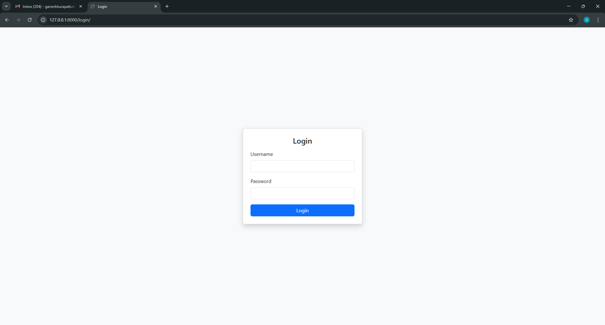
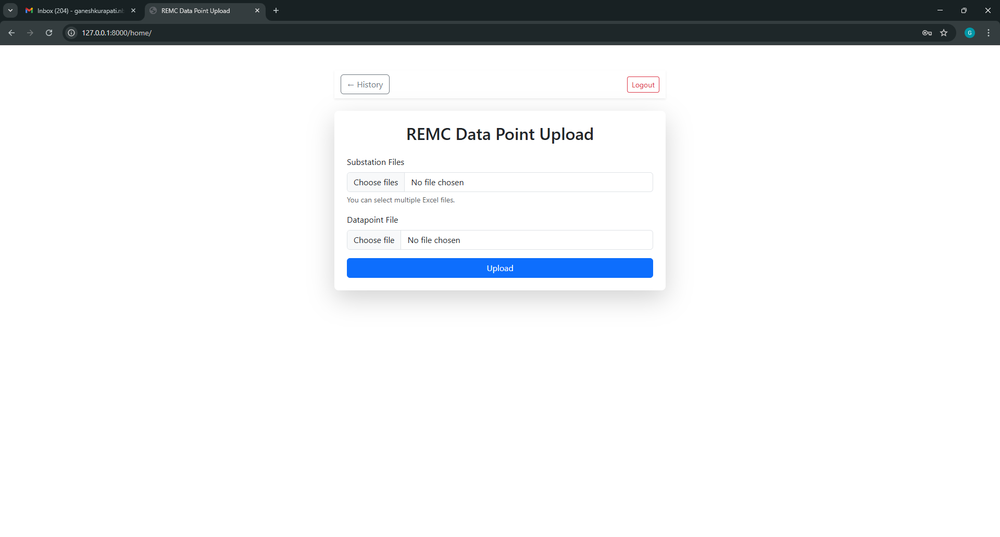
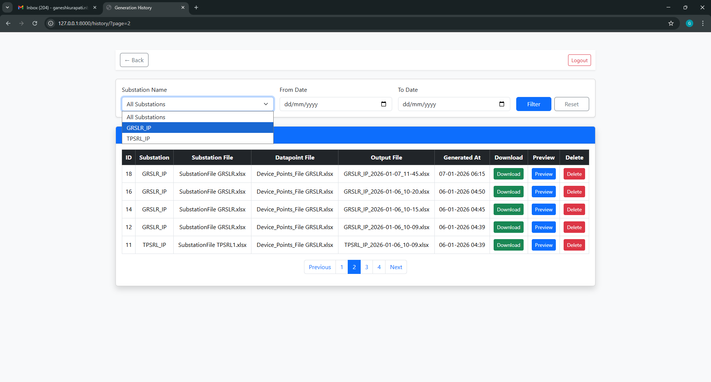
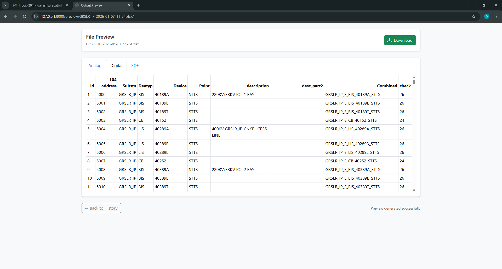

<h1>REMC Data Point Generator (Web Application)</h1>

<strong>Tech Stack:</strong> Python • Django • Pandas • Excel Automation

A web-based system that automatically generates REMC datapoints from substation and device metadata. 
The application streamlines Excel generation, formatting, device logic mapping, and file handling—reducing manual effort by over <strong>70%</strong>.

<h2>🚀 Features</h2>

<h3>⚙️ Automated Datapoint Generation</h3>
<ul>
  <li>Converts substation & device metadata into standardized REMC datapoints.</li>
  <li>Implements custom logic mappings for diverse device configurations.</li>
  <li>Generates formatted Excel output files automatically.</li>
</ul>

<h3>📤 Web-Based File Upload & Download</h3>
<ul>
  <li>Users can upload metadata files directly through the web interface.</li>
  <li>System auto-generates downloadable Excel datapoint files.</li>
  <li>Replaces manual Tkinter-based desktop workflows with a modern browser UI.</li>
</ul>

<h3>🧠 Backend Processing & Automation</h3>
<ul>
  <li>Powered by <strong>Django</strong> & <strong>Pandas</strong> for fast and robust processing.</li>
  <li>Template-driven Excel generation ensures consistent REMC formats.</li>
  <li>Input validation to maintain accuracy and reliability.</li>
</ul>

<h3>📉 Productivity Improvements</h3>
<ul>
  <li>Eliminates repeated manual data entry.</li>
  <li>End-to-end automation reduces preparation time by over <strong>70%</strong>.</li>
</ul>

<h2>🏗️ Architecture Overview</h2>
<pre>
User Interface (Browser)
       ↓
Django Web Application
       ↓
Pandas Processing Engine
       ↓
Excel Generator (Formatted Output)
       ↓
Downloadable REMC Datapoint File
</pre>

<h2>📌 How It Works</h2>
<ol>
  <li><strong>Upload</strong> a metadata file (Excel/CSV).</li>
  <li>The backend <strong>processes</strong> the file using Pandas.</li>
  <li>Device logic rules map the input to REMC datapoints.</li>
  <li>An Excel output file is <strong>generated & formatted</strong> automatically.</li>
  <li>The user <strong>downloads</strong> the final datapoint file.</li>
</ol>

#Login Page

#File Upload

#File Upload History

#Preview output Generate File

#Output Generate Complete

